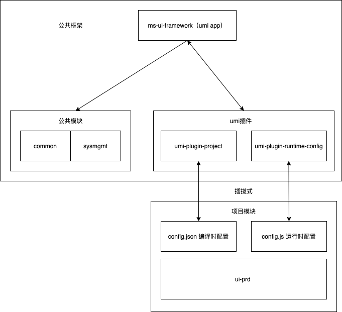

## umi-plugin-runtime-config

解决的是使用umi框架时分项目模块开发的需求

### 痛点

如公司同时启动了多个项目或产品，而这几个项目和产品隶属于不同的团队和部门，但是都有着同样的基础功能，

比如一些公共的系统功能
登陆退出逻辑、sso单点登陆功能、用户管理模块、组织管理模块、角色管理模块、权限管理模块、系统参数管理模块、工作流模块……

比如一些项目定制的需求
logo、appName、theme……

比如一些公共前端功能
模块路由、模块的接口代理、布局方式、全局水印、仪表板……

我们如果是copy一个脚手架，然后每个项目部门都从头开发开发这些基础功能，就非常耗时耗力，项目组不能及时获取到框架的最新功能，而且几个维护成本会变高

### 目标
1. 项目组和框架组隔离开发，项目组不能修改框架的代码，架构组也不能修改项目组的代码
2. 项目可以高自由度的配置、选择性的使用框架提供的功能
3. 项目可以随时更新获取框架提供的最新功能

### 方案
所以，可以采取一种可插拔的方式实现项目模块和框架的隔离开发

框架模块包含许多基础公共功能，

项目模块就是项目业务代码、不用关心基础、公共功能的实现，只需要配置即可获得某种能力，这就是umi-plugin-runtime-config 和umi-plugin-project所做的事, 

而umi-plugin-runtime-config解决的是运行时配置，比如说预定义当前项目所需的时间格式，比如用户密码所要被约束的正则，比如登录之后的回调方法，比如要设置项目所需组件的初始参数，项目所需的主题，比如项目spin类型，项目iconfont仓库地址……

运行时配置比较自由，可以写任何运行时的代码



### 实现
umi-plugin-runtime-config 主要逻辑就是抓取了pages下的页面模块然后把所有项目模块的运行时config.js生成成一个文件夹 src/.temp, 逻辑和.umi文件夹类似，.temp文件夹下的config按需使用，一般都是先做一次合并，如下

```ts
//src/config.ts
import CONFIG from '@/.temp';
let config: object = {};
if (CONFIG) {
  _.sortBy(CONFIG, function (item) {
    return item['ORDER'];
  });
  const customizer = (objValue: any, srcValue: any): any => {
    if (_.isArray(objValue)) {
      return objValue.concat(srcValue);
    }
  }
  config = _.mergeWith(...CONFIG, customizer)
  delete config['ORDER']
}

export default config
```


### 强制约定
项目模块：pages下的第一层目录，如 src/pages/sysmgmt

项目模块运行时配置：页面模块目录下的config.js, 如src/pages/sysmgmt/config.js

必有参数：

| 参数名 | 描述                                           | 类型   | 必传 |
| ------ | ---------------------------------------------- | ------ | ---- |
| ORDER  | 多个模块config merge时的顺序，数字越大权重越高 | number | true |


### config.js示例
``` js
const ORDER = 0;

//公用配置信息
const COMMON_CONFIG = {
  // 默认时间字符串格式
  defaultDateFormat: 'YYYY-MM-DD HH:mm:ss',
  //上传文件的大小的最大值(M)
  uploadFileSize: 10,
  //单点登录
  sso: false,
  //按顺序加载登录链js文件及方法
  loginChain: [],
  //按顺序加载登出链js文件及方法
  logoutChain: [],
  ……
}
export default {
  COMMON_CONFIG,
  ORDER,
}

```

### 注意
1. 使用此插件必须遵循上述的一些约定
2. 项目模块和框架的插拔方式实现一般是git仓库嵌套git仓库的方式，或者gitsubmodule+symbolLink的方式
3. 此插件解决的运行时配置的处理，即config.js, 如果需要编译时配置config.json的处理，可结合使用编译时配置插件 umi-plugin-project


